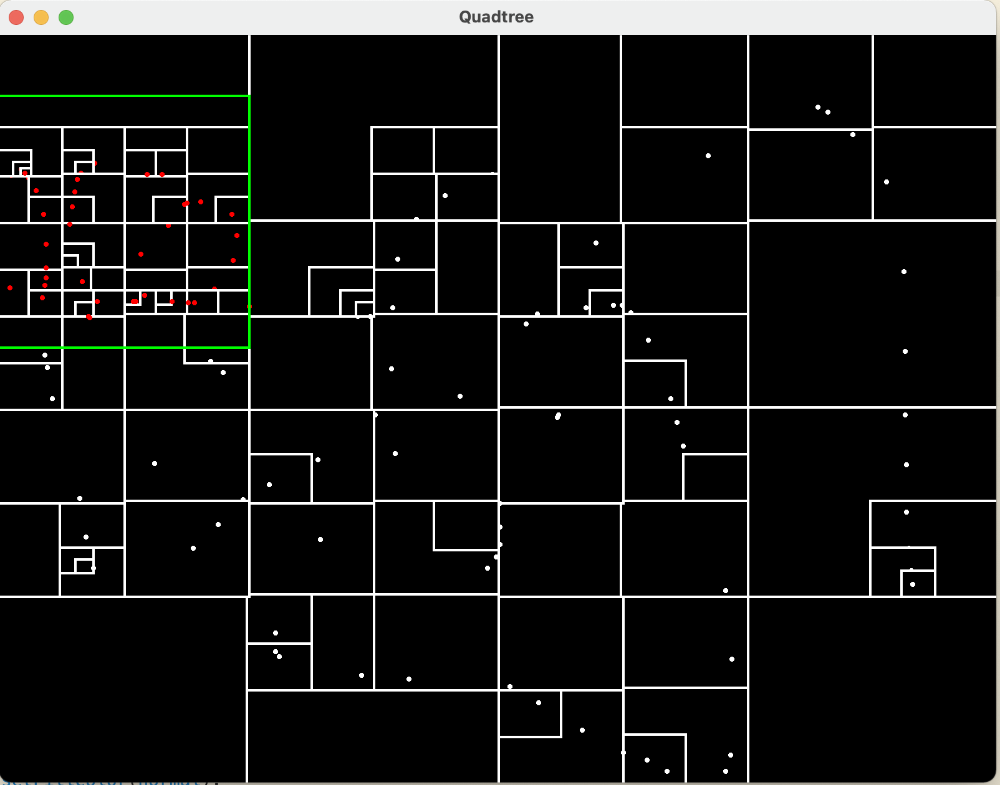

# Quadtree

In this application, you can insert points in the 2D space by moving the mouse around.
You can stop inserting points by clicking the mouse anywhere and vice versa.
The quadtree accepts the points on the screen and subdivides the larger areas into smaller
ones that contain the points in inside it. The green rectangle shows the selected region.
By pressing the Q key, you can query through the quadtree and it will mark the points currently
in the selected region red.

The framework used for graphics is SFML. You must install SFML in your system's library path to run the
executable. To compiled the project, run 'make' in the root directory. It will generate the exectuable
in the same directory called 'main'. Type './main' to launch the app...
