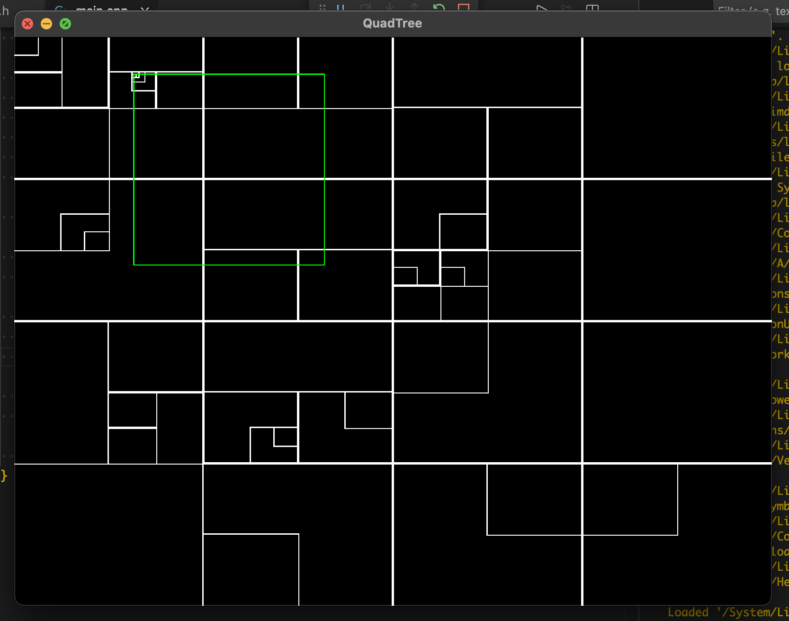
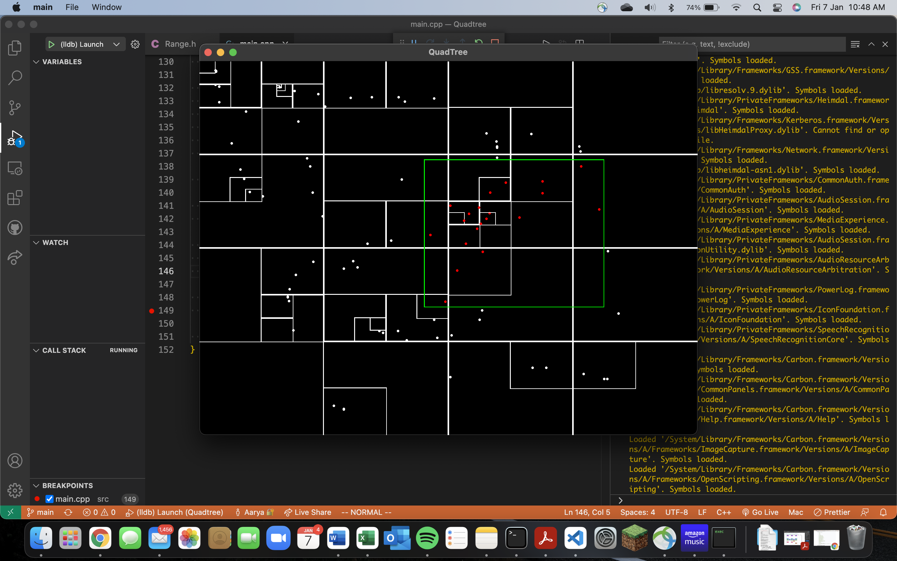
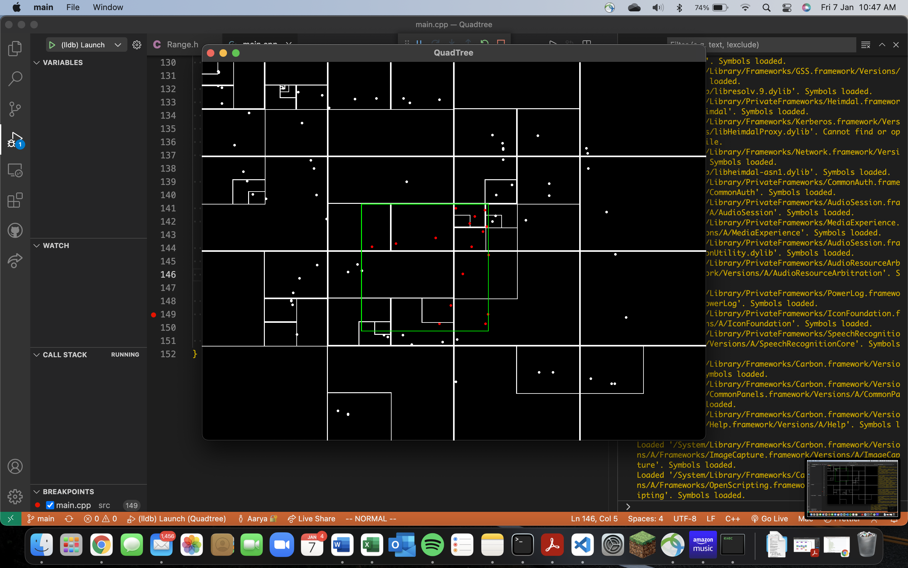

# Quadtree

## Build

The framework used for graphics is SFML. You must install SFML to run the application. 

To compile the code, run 'make' from the project directory. This will generate the exectuable in the same directory called 'main'. 

Run './main' to launch the application.

## Introduction 

A quadtree is a data structure which can efficiently store points in a 2D space. It is a 4-ary tree with each node containing upto a fixed capacity of points. Each node represents a subdivision of the 2D space.

The white rectangles represent the structure of the quad tree. The green rectangle shows the selected region. The points outside the selected region are colored white and the points inside are colored red.

### Instructions

### Key Controls

* Esc: Close window
* C: Clear all points
* P: Toggle enter/exit Insert Mode
* S: Toogle show/hide points
* G: Toggle show/hide grid lines
* I: Print total points to Console
* Left/Right Arrow Keys: Increase/Decrease width of query region
* Up/Down Arrow Keys: Increase/Decrease height of query region

### Mouse Controls

* Left click to query a rectangular region with the top-left corner at the mouse cursor.
    * The boundary of this region is green.
    * The points inside the region turn red.
* Drag the cursor to add points.
    * The points are added automatically at the position of the mouse cursor.
    * Exit the Insert Mode to stop adding new points.

## Result

